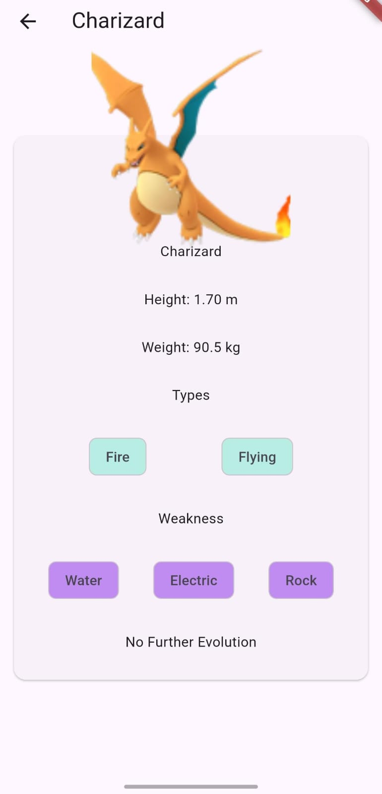
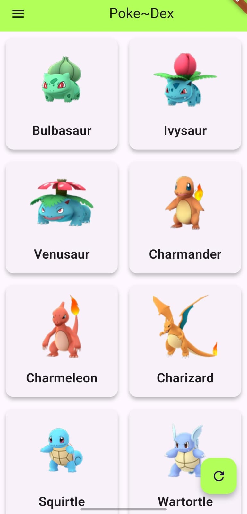
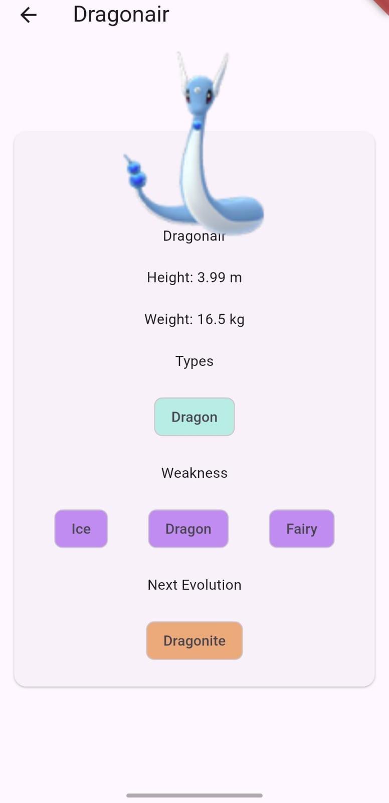

# Pokedex

A cross-platform Pokedex app built with Flutter.  
**This project was created for fun and to learn API fetching in Flutter.**

---

## 📱 Demo

Displays Pokémon details, images, and stats fetched from an API.

<p align="center">
  
  
  
</p>

---

## 🚀 Tech Stack & Libraries

- **Flutter**: Main UI framework (cross-platform mobile/web/desktop)
- **Dart**: Programming language
- **HTTP**: API fetching (via [http](https://pub.dev/packages/http) package)
- **JSON Serialization**: For parsing API responses

---

## 🎯 Features

- Search and browse Pokémon with images, stats, and evolution info
- Fetches live data from a public Pokémon API
- Responsive and adaptive UI
- Runs on Android, iOS, Web, Windows, and Linux (via Flutter)

---

## 🛠️ Getting Started

1. **Clone the repository:**
   ```bash
   git clone https://github.com/Divyanshu-yadav-18/Pokedex.git
   cd Pokedex
   ```
2. **Install dependencies:**
   ```bash
   flutter pub get
   ```
3. **Run the app:**
   ```bash
   flutter run
   ```
   Or use your IDE (Android Studio, VS Code) to run on emulator/device.

---

## 🤝 Contributing

Feel free to fork and open pull requests!  
Any suggestions or improvements are welcome.

---

## 👤 Author

Built by [Divyanshu Yadav](https://github.com/Divyanshu-yadav-18)
